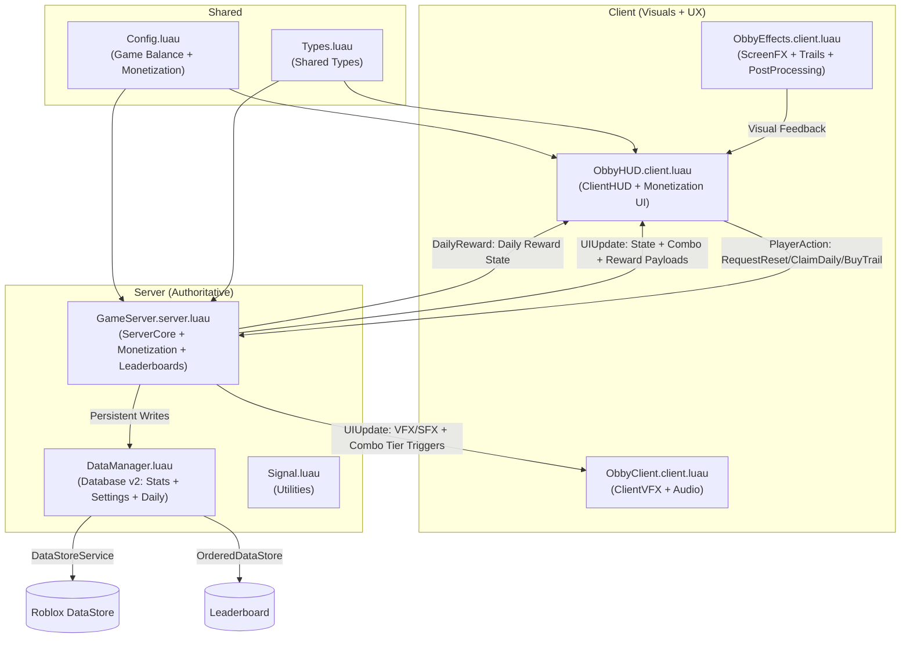

# Brainrot Checkpoint Obby - S-TIER Edition
## Master Context Scaffold v2.0

This scaffold provides a deterministic, zero-ambiguity model of the Brainrot Checkpoint Obby codebase — now rebuilt for maximum retention, monetization, and S-tier player experience.

---

## 1. Architectural Blueprint

The codebase enforces a secure, highly-optimized client-server topology to defeat exploit engines while delivering dopamine-rich, low-latency feedback loops.

### Authoritative System Flow


### Architectural Invariants
* **Zero Client Authority**: All speedrun durations, check-in sequences, coin balances, combo multipliers, and run completions are processed, validated, and computed strictly on the server.
* **Monetization Hooks**: Gamepasses (2x Coins, VIP), Developer Products (coin packs), and Premium Benefits (+20% coins) are all computed server-authoritatively.
* **Atomic Merge Saves**: Player stats use `UpdateAsync` for competitive integrity. Settings and daily rewards use `SetAsync` for non-conflicting data.
* **Combo System**: Server-validated consecutive checkpoint streaks within `COMBO_WINDOW_SECONDS` yield escalating multipliers up to 3x.
* **Daily Rewards**: Streak-based reward system with Roblox Premium bonus tiers.

---

## 2. Semantic Code Intelligence (S-TIER Symbols)

| Symbol | Kind | Intent | Domain | Location | Primary Consumers |
| :--- | :--- | :--- | :--- | :--- | :--- |
| `DataManager` | Module | Safe pcall-wrapped persistent storage with NaN guards, separate stats/settings stores. | `Database` | `src/ServerScriptService/DataManager.luau:11` | `GameServer` |
| `PlayerData` | Type | Core competitive stats (bestTime, runs, coins). | `Database` | `src/ServerScriptService/DataManager.luau:54` | `GameServer`, `DataManager` |
| `PlayerSettings` | Type | SFX/music toggles, owned cosmetics, equipped trail/aura. | `Database` | `src/ServerScriptService/DataManager.luau:60` | `GameServer` |
| `DailyRewardState` | Type | Last claim date and streak counter. | `Database` | `src/ServerScriptService/DataManager.luau:70` | `GameServer` |
| `Config` | Module | Central game balance: prices, multipliers, combo tiers, cosmetic costs. | `Shared` | `src/ReplicatedStorage/Config.luau:8` | `GameServer`, `ObbyHUD` |
| `GameServer` | Script | Authoritative server with monetization, combo system, daily rewards, leaderboards. | `ServerCore` | `src/ServerScriptService/GameServer.server.luau:18` | -- |
| `startRun` | Function | Boots speedrun with combo reset and monetization flag sync. | `ServerCore` | `src/ServerScriptService/GameServer.server.luau:210` | `GameServer` |
| `finishRun` | Function | Computes run with combo multipliers, updates leaderboard if new best. | `ServerCore` | `src/ServerScriptService/GameServer.server.luau:245` | `GameServer` |
| `updateCombo` | Function | Validates combo window, returns multiplier tier. | `ServerCore` | `src/ServerScriptService/GameServer.server.luau:145` | `GameServer` |
| `checkDailyReward` | Function | Streak calculation, Premium bonus application. | `ServerCore` | `src/ServerScriptService/GameServer.server.luau:185` | `GameServer` |
| `calculateCoinReward` | Function | Applies gamepass/premium/combo multipliers. | `ServerCore` | `src/ServerScriptService/GameServer.server.luau:233` | `GameServer` |
| `ObbyHUD` | Script | Glassmorphism HUD with progress bars, combo counter, daily rewards, badges. | `ClientHUD` | `src/StarterGui/ObbyHUD.client.luau:8` | Client Engine |
| `ObbyClient` | Script | Layered audio with combo pitch shifts, ring explosions, dramatic bursts. | `ClientVFX` | `src/StarterPlayerScripts/ObbyClient.client.luau:8` | Client Engine |
| `ObbyEffects` | Script | Screen flash, character trails, chromatic aberration, post-processing. | `ClientFX` | `src/StarterPlayerScripts/ObbyEffects.client.luau:8` | Client Engine |
| `Signal` | Module | Zero-allocation event utility with FIFO ordering. | `Utilities` | `src/ServerScriptService/Signal.luau:46` | `test_signal` |

---

## 3. Monetization Architecture

### Gamepasses (One-time purchase, permanent benefit)
| ID | Name | Benefit | Implementation |
|----|------|---------|----------------|
| `DOUBLE_COINS` | 2x Coins | All coin earnings doubled | `calculateCoinReward` multiplies by 2.0 |
| `VIP` | VIP | +50% coins, golden name tag, rainbow trail | Coin multiplier + VIP tag via `StringValue` |

### Developer Products (Consumable)
| ID | Name | Benefit |
|----|------|---------|
| `COINS_SMALL` | Coin Pack (100) | +100 coins instantly |
| `COINS_MEDIUM` | Coin Pack (500) | +500 coins instantly |
| `COINS_LARGE` | Coin Pack (2,000) | +2,000 coins instantly |

### Roblox Premium Benefits
* +20% coin bonus on all earnings
* +50 bonus coins on daily rewards
* Premium badge on HUD

---

## 4. Retention Systems

### Combo System
* **Window**: `COMBO_WINDOW_SECONDS = 8.0`
* **Tiers**: 3 checkpoints = 1.5x, 5 = 2.0x, 8 = 3.0x (GODLIKE!)
* **Visual**: Combo counter appears at 2+, color shifts gold → orange → red
* **Audio**: Pitch rises with each tier

### Daily Rewards
* **Base**: 50 coins
* **Streak Bonus**: +10 per streak day (max 7 days)
* **Premium Bonus**: +50 extra
* **UI**: Slide-in popup with claim button

### Leaderboards
* **Storage**: OrderedDataStore (`ObbyLeaderboard_v1`)
* **Update**: On new best time only
* **Scope**: Global (all servers)

---

## 5. Standard Operating Procedures

### Naming Taxonomy
* **PascalCase**: Applied to Roblox Services, files, module names, and custom class instances.
* **camelCase**: Applied to local variables, function parameters, and dictionary/JSON fields.
* **UPPER_SNAKE_CASE**: Applied to top-level module constants and config values.

### Import Order Guidelines
1. **Roblox Core Engine Services**: Retrieved exclusively through `game:GetService()`.
2. **Shared Modules**: `Types` and `Config` from `ReplicatedStorage`.
3. **Local Module Dependencies**: Required via exact paths relative to top levels.
4. **Internal Variables and Constants**: Initialized local scope parameters.

### Error Handling & Logging
* **Safe Wrapping**: Wrap all external platform interfaces in standard `pcall` operations.
* **Retry Loops**: Implement retry cycles with scaling exponential wait times for transient outages.
* **NaN Guards**: `v ~= v` detection before all mathematical operations on stored data.
* **Logging Scopes**: Format logs explicitly using brackets: `[GameServer]`, `[DataManager]`, `[ObbyHUD]`, `[ObbyClient]`, `[ObbyEffects]`.

---

## 6. Development Lifecycle and Tooling

| Task | Command | Working Dir | Notes |
| :--- | :--- | :--- | :--- |
| **install** | `npm install -g rojo` | Workspace Root | Install Rojo globally. |
| **dev** | `rojo serve` | Workspace Root | Launch Rojo websocket server. |
| **build** | `rojo build -o obby.rbxl` | Workspace Root | Build static `.rbxl` place file. |
| **sourcemap** | `rojo sourcemap default.project.json -o sourcemap.json` | Workspace Root | Update sourcemap for type resolution. |
| **test** | `lune run test_signal && lune run test_datamanager` | Workspace Root | Run all test suites. |
| **deploy** | `rojo build -o obby.rbxl` | Workspace Root | Build for publishing. |

---

## 7. Testing and Quality Assurance

### Testing Paradigm
* **Unit Level**: Signal utility (`test_signal.luau`) + DataManager v2 (`test_datamanager.luau` with 9 test cases).
* **Integration Level**: Multi-client local server simulations in Studio.
* **Monetization Testing**: Use Roblox Studio's "Simulate Purchase" for gamepass/product validation.

### Test Coverage
| Test | File | Assertions |
|------|------|------------|
| T1 | Default data load | Stats default to 999999/0/0 |
| T2 | Save/load round-trip | Values persist accurately |
| T3 | Schema merge | Negative/float values clamped, unknown fields stripped |
| T4 | Retry success | 2 failures → success on 3rd attempt |
| T5 | Retry failure | 4 failures → returns safe defaults |
| T6 | Atomic merge | Conflicts resolved with min(bestTime)/max(runs)/max(coins) |
| T7 | NaN recovery | NaN inputs fall back to defaults; subsequent saves work |
| T8 | Settings persistence | SFX, trail color, owned cosmetics persist |
| T9 | Daily reward persistence | Date and streak persist |

---

## 8. Contextual Knowledge Graph

* `[ServerCore]` -> requires -> `[Database]` : Orchestrates persistence for stats, settings, and daily rewards.
* `[ServerCore]` -> requires -> `[Config]` : Reads game balance constants, prices, multipliers.
* `[ServerCore]` -> pushes updates to -> `[ClientHUD]` : Synchronizes timer, combo, progress bar, daily rewards.
* `[ServerCore]` -> triggers -> `[ClientVFX]` : Broadcasts VFX/SFX with combo tier data.
* `[ServerCore]` -> triggers -> `[ClientFX]` : Trail creation, screen flash, post-processing bloom.
* `[ClientHUD]` -> submits actions to -> `[ServerCore]` : Reset, daily claim, shop purchases.
* `[ClientVFX]` -> coordinates with -> `[ClientFX]` : Shared camera state, cleanup on script destroy.

---

## 9. Risks and Bottlenecks (S-TIER Mitigated)

| Risk | Impact | Evidence | Mitigation |
| :--- | :--- | :--- | :--- |
| **DataStore Outages** | High | `DataManager.luau:72-84` | 3-retry exponential backoff; buffered server state; separate stats/settings stores. |
| **NaN Corruption** | Critical | `DataManager.luau:94-115` | `v ~= v` detection before all math; NaN treated as worst default in merge. |
| **Character Spawn Issues** | Medium | `GameServer.server.luau:490-503` | `WaitForChild` with 5s timeout; early-exit guards; `isRunning` state check. |
| **Client Timer Desync** | Low | `ObbyHUD.client.luau:245-253` | Client timer is visual only; server computes final time authoritatively. |
| **Memory Leaks** | Low | `ObbyEffects.client.luau:173-181` | `Destroying` event disconnects all RenderStepped connections. |
| **Monetization Fraud** | High | `GameServer.server.luau:428-441` | All purchases validated server-side via `MarketplaceService.ProcessReceipt`. |
| **Table Mutation During Iteration** | Medium | `GameServer.server.luau:523-557` | `pairs()` snapshot into `statesToSave` before mutation. |

---

## 10. Quick Agent Boot

1. **Install Rojo globally**:
   ```bash
   npm install -g rojo
   ```
2. **Build Roblox place binary**:
   ```bash
   rojo build -o obby.rbxl
   ```
3. Open `obby.rbxl` using **Roblox Studio**.
4. Enable Cloud API access: **Home > Game Settings > Security > Enable Studio Access to API Services > ON**.
5. Enable MarketplaceService (for monetization): **Home > Game Settings > Monetization > Enable**.
6. Connect Rojo sync service: Click **Connect** in the Rojo Studio Plugin panel.
7. Playtest: Press **F5** to test gameplay, UI, combo system, and persistence.

---

## 11. Feature Summary (S-TIER Edition)

### Gameplay
- [x] Authoritative checkpoint speedrun system
- [x] Anti-cheat speed validation (150 studs/s max)
- [x] Coin collection with distance validation
- [x] Combo system (up to 3x multiplier)
- [x] Daily rewards with streaks

### Monetization
- [x] 2x Coins Gamepass
- [x] VIP Gamepass (+50% coins, golden tag)
- [x] Developer Products (coin packs)
- [x] Roblox Premium benefits (+20% coins)
- [x] In-game shop (trail/aura purchases)

### Social
- [x] OrderedDataStore global leaderboard
- [x] VIP/Premium/2x badges on HUD
- [x] Leaderstats display (BestTime, Coins, Runs)

### Visual
- [x] Glassmorphism HUD with animated progress bars
- [x] Combo counter with tier colors
- [x] Floating combat text for coins
- [x] Screen flash effects (new best, combo milestones)
- [x] Character trails (rainbow, fire, ice, neon, gold)
- [x] Ring explosions on checkpoints
- [x] Post-processing bloom + color correction
- [x] Chromatic aberration at high speeds
- [x] Vignette overlay for focus

### Audio
- [x] Dynamic pitch shift on combo tiers
- [x] Layered success tones
- [x] Checkpoint/coin/finish audio feedback

### Data
- [x] NaN-safe DataStore operations
- [x] Separate stats (atomic merge) and settings (SetAsync) stores
- [x] Daily reward persistence
- [x] Cosmetic ownership tracking
