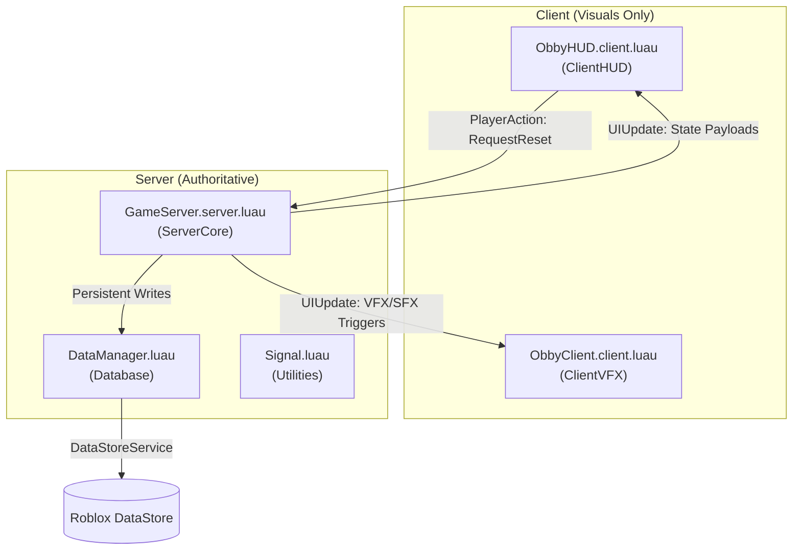

# Brainrot Checkpoint Obby - Master Context Scaffold

This scaffold provides a deterministic, zero-ambiguity model of the Brainrot Checkpoint Obby codebase. Designed for AI coding agents and engineering audits, it structures system topology, domain boundaries, and testing patterns.

## 1. Architectural Blueprint

The codebase enforces a secure, highly-optimized client-server topology to defeat exploit engines while delivering low-latency feedback.

### Authoritative System Flow


### Architectural Invariants
* **Zero Client Authority**: All speedrun durations, check-in sequences, coin balances, and run completions are processed, validated, and computed strictly on the server (`src/ServerScriptService/GameServer.server.luau:40-42`).
* **Minimal Payloads**: Network boundaries use thin event triggers (`src/ServerScriptService/GameServer.server.luau:160-167`). Clients reconstruct visual states locally to mitigate packet-tampering.
* **Atomic Merge Saves**: Player stats are never blindly overwritten. Persistent writes utilize a conflict-free merge algorithm via `UpdateAsync` to resolve cross-server sessions safely (`src/ServerScriptService/DataManager.luau:93-107`).

---

## 2. Semantic Code Intelligence

| Symbol | Kind | Intent | Domain | Location (path:lines) | Primary Consumers |
| :--- | :--- | :--- | :--- | :--- | :--- |
| `DataManager` | Module | Safe pcall-wrapped persistent storage module. | `Database` | [`src/ServerScriptService/DataManager.luau:13`](file:///c:/Users/Donov/roblox/src/ServerScriptService/DataManager.luau#L13) | `GameServer` |
| `PlayerData` | Type | Representation of serialized player stats. | `Database` | [`src/ServerScriptService/DataManager.luau:21-25`](file:///c:/Users/Donov/roblox/src/ServerScriptService/DataManager.luau#L21-L25) | `GameServer`, `DataManager` |
| `loadPlayerData` | Function | Fetches player stats, fallbacks to defaults on failure. | `Database` | [`src/ServerScriptService/DataManager.luau:56-80`](file:///c:/Users/Donov/roblox/src/ServerScriptService/DataManager.luau#L56-L80) | `GameServer` |
| `savePlayerData` | Function | Saves statistics using an atomic conflict-merge. | `Database` | [`src/ServerScriptService/DataManager.luau:86-118`](file:///c:/Users/Donov/roblox/src/ServerScriptService/DataManager.luau#L86-L118) | `GameServer` |
| `PlayerState` | Type | Tracks local-session state for active runs on server. | `ServerCore` | [`src/ServerScriptService/GameServer.server.luau:45-54`](file:///c:/Users/Donov/roblox/src/ServerScriptService/GameServer.server.luau#L45-L54) | `GameServer` |
| `startRun` | Function | Boots speedrun session and teleports player to spawn. | `ServerCore` | [`src/ServerScriptService/GameServer.server.luau:136-169`](file:///c:/Users/Donov/roblox/src/ServerScriptService/GameServer.server.luau#L136-L169) | `GameServer` |
| `finishRun` | Function | Computes run duration and initiates persistence logic. | `ServerCore` | [`src/ServerScriptService/GameServer.server.luau:171-207`](file:///c:/Users/Donov/roblox/src/ServerScriptService/GameServer.server.luau#L171-L207) | `GameServer` |
| `onCheckpointTouched` | Function | Handles and validates checkpoint touch event ordering. | `ServerCore` | [`src/ServerScriptService/GameServer.server.luau:212-255`](file:///c:/Users/Donov/roblox/src/ServerScriptService/GameServer.server.luau#L212-L255) | `GameServer` |
| `Signal` | Module | Zero-allocation internal event utility. | `Utilities` | [`src/ServerScriptService/Signal.luau:46`](file:///c:/Users/Donov/roblox/src/ServerScriptService/Signal.luau#L46) | `test_signal` |
| `Fire` | Method | Triggers active signal listeners with arguments. | `Utilities` | [`src/ServerScriptService/Signal.luau:73-101`](file:///c:/Users/Donov/roblox/src/ServerScriptService/Signal.luau#L73-L101) | `test_signal` |
| `gui` | Instance | Programmatic ScreenGui hierarchy driver. | `ClientHUD` | [`src/StarterGui/ObbyHUD.client.luau:34-38`](file:///c:/Users/Donov/roblox/src/StarterGui/ObbyHUD.client.luau#L34-L38) | Client Engine |
| `showNotification` | Function | Displays glassmorphic pop-up alerts on screen. | `ClientHUD` | [`src/StarterGui/ObbyHUD.client.luau:259-291`](file:///c:/Users/Donov/roblox/src/StarterGui/ObbyHUD.client.luau#L259-L291) | `ObbyHUD` |
| `uiUpdate` | RemoteEvent | Event listener for visual updates pushed by server. | `ClientHUD`, `ClientVFX` | [`src/StarterGui/ObbyHUD.client.luau:15`](file:///c:/Users/Donov/roblox/src/StarterGui/ObbyHUD.client.luau#L15), [`src/StarterPlayerScripts/ObbyClient.client.luau:14`](file:///c:/Users/Donov/roblox/src/StarterPlayerScripts/ObbyClient.client.luau#L14) | `ObbyHUD`, `ObbyClient` |
| `spawnBurst` | Function | Generates particles in 3D world space. | `ClientVFX` | [`src/StarterPlayerScripts/ObbyClient.client.luau:56-80`](file:///c:/Users/Donov/roblox/src/StarterPlayerScripts/ObbyClient.client.luau#L56-L80) | `ObbyClient` |
| `playTone` | Function | Synthesizes an interactive audio beep. | `ClientVFX` | [`src/StarterPlayerScripts/ObbyClient.client.luau:85-100`](file:///c:/Users/Donov/roblox/src/StarterPlayerScripts/ObbyClient.client.luau#L85-L100) | `ObbyClient` |

---

## 3. Standard Operating Procedures

### Naming Taxonomy
* **PascalCase**: Applied to Roblox Services, files, module names, and custom class instances (e.g. `CollectionService`, `DataManager.luau`, `Signal`).
* **camelCase**: Applied to local variables, function parameters, and dictionary/JSON fields (e.g. `playerStates`, `bestRunTimeSeconds`).
* **UPPER_SNAKE_CASE**: Applied to top-level module constants (e.g. `RESET_COOLDOWN = 1.0`, `TOUCH_DEBOUNCE = 0.15`, `STORE_NAME = "ObbyPlayerData_v1"`).

### Import Order Guidelines
1. **Roblox Core Engine Services**: Retrieved exclusively through `game:GetService()` (`src/ServerScriptService/GameServer.server.luau:18-21`).
2. **Local Module Dependencies**: Required via exact paths relative to top levels (`src/ServerScriptService/GameServer.server.luau:23`).
3. **Internal Variables and Constants**: Initialized local scope parameters.

### Error Handling & Logging
* **Safe Wrapping**: Wrap all external platform interfaces (e.g., DataStores, HTTP requests) in standard `pcall` operations (`src/ServerScriptService/DataManager.luau:42`).
* **Retry Loops**: Implement retry cycles with scaling exponential wait times for transient outages (`src/ServerScriptService/DataManager.luau:49`).
* **Logging Scopes**: Format logging logs explicitly using brackets: `[GameServer]`, `[DataManager]`, `[ObbyHUD]`, `[ObbyClient]` (`src/ServerScriptService/GameServer.server.luau:99`).

---

## 4. Development Lifecycle and Tooling

| Task | Command | Working Dir | Notes |
| :--- | :--- | :--- | :--- |
| **install** | `npm install -g rojo` | Workspace Root | Install the Rojo synchronization CLI utility globally. |
| **dev** | `rojo serve` | Workspace Root | Launch local Rojo websocket server to synchronize workspace modifications into Studio. |
| **build** | `rojo build -o obby.rbxl` | Workspace Root | Build the static Roblox Place file (`.rbxl`) mapping the filesystem onto game services. |
| **typecheck** | `rojo sourcemap default.project.json -o sourcemap.json` | Workspace Root | Update the Rojo sourcemap to resolve absolute package references. |
| **lint** | `N/A` | `N/A` | Automated linting not configured. Manual audit checks are applied directly. |
| **test** | `lune run test_signal` | Workspace Root | Executes standalone Signal unit test suite verifying memory limits and yielding (requires Lune). |
| **migrate** | `N/A` | `N/A` | Schemas are handled programmatically and merged inline within `src/ServerScriptService/DataManager.luau:89-108`. |
| **seed** | `N/A` | `N/A` | Persistence is initialized dynamically on player session initialization. |
| **deploy** | `rojo build -o obby.rbxl` | Workspace Root | Re-builds standard place file for publishing to Roblox Cloud or Roblox Asset Manager. |

---

## 5. Testing and Quality Assurance

### Testing Paradigm
* **Unit Level**: Programmatic testing of the optimized Event `Signal` utility (`test_signal.luau:1-72`). Focuses on checking allocation-free fires, thread yielding bounds, and runtime memory usage.
* **Integration Level**: Multi-client local server simulations run in Studio (**Test > Local Server > 2 Players > Start**) to verify replication, visual syncing, and transaction merges on exit.

### Assertions and Validation Metrics
* **Warm Memory Assertions**: Signals must allocate exactly 0 new bytes after initial warmup execution loops (`test_signal.luau:20`).
* **Yielding Safety**: Yielded coroutines within listeners must not freeze the main game execution or execution of adjacent subscribers (`test_signal.luau:41`).
* **Concurrent Operations**: Disconnection events fired inside loop sequences must handle dynamically without runtime error collapses (`test_signal.luau:65`).

---

## 6. Contextual Knowledge Graph

* `[ServerCore] in src/ServerScriptService/GameServer.server.luau` -> requires -> `[Database] in src/ServerScriptService/DataManager.luau` : Orchestrates persistence actions for multiplayer session loads, runs, and closes.
* `[ServerCore] in src/ServerScriptService/GameServer.server.luau` -> pushes updates to -> `[ClientHUD] in src/StarterGui/ObbyHUD.client.luau` : Synchronizes speedrun stopwatch records and checkpoint progress to display.
* `[ServerCore] in src/ServerScriptService/GameServer.server.luau` -> triggers -> `[ClientVFX] in src/StarterPlayerScripts/ObbyClient.client.luau` : Broadcasts event updates to run immersive audio and visual particles.
* `[ClientHUD] in src/StarterGui/ObbyHUD.client.luau` -> submits actions to -> `[ServerCore] in src/ServerScriptService/GameServer.server.luau` : Transmits stopwatch reset commands to restart running timers.
* `[Utilities] in src/ServerScriptService/Signal.luau` -> verified by -> `[test_signal.luau] in test_signal.luau` : Guarantees correct allocation footprint and async resilience before production deploy.

---

## 7. Risks and Bottlenecks

| Risk | Impact | Evidence | Mitigation Hint |
| :--- | :--- | :--- | :--- |
| **DataStore Outages & Rate Limits** | High | [`src/ServerScriptService/DataManager.luau:58-60`](file:///c:/Users/Donov/roblox/src/ServerScriptService/DataManager.luau#L58-L60) | Buffer state data in server storage (`playerStates`). Limit saves strictly to run completions, leaves, or shutdowns. |
| **Character Spawn & Streaming Yields** | Medium | [`src/ServerScriptService/GameServer.server.luau:150-158`](file:///c:/Users/Donov/roblox/src/ServerScriptService/GameServer.server.luau#L150-L158) | Implement resilient waiting routines yielding until `HumanoidRootPart` is loaded before applying coordinates. |
| **Local / Server Timer Desynchronization** | Low | [`src/StarterGui/ObbyHUD.client.luau:241-245`](file:///c:/Users/Donov/roblox/src/StarterGui/ObbyHUD.client.luau#L241-L245) | Define client-side stopwatch timers strictly for visual displays; validate final speedrun values on server. |
| **Signal Memory Leaks** | Low | [`src/ServerScriptService/Signal.luau:55-71`](file:///c:/Users/Donov/roblox/src/ServerScriptService/Signal.luau#L55-L71) | Ensure all active connections are disconnected and un-referenced when objects are dereferenced. |

---

## 8. Quick Agent Boot

To establish an active workspace and boot development:

1. **Install Rojo globally**:
   ```bash
   npm install -g rojo
   ```
2. **Build Roblox place binary**:
   ```bash
   rojo build -o obby.rbxl
   ```
3. Open `obby.rbxl` using **Roblox Studio**.
4. Enable Cloud API access: Navigate to **Home > Game Settings > Security > Enable Studio Access to API Services > ON**.
5. Connect Rojo sync service: Click the **Connect** button inside the Rojo Roblox Studio Plugin panel.
6. Playtest: Press **F5** in Roblox Studio to playtest the gameplay, UI updates, and persistence triggers.
